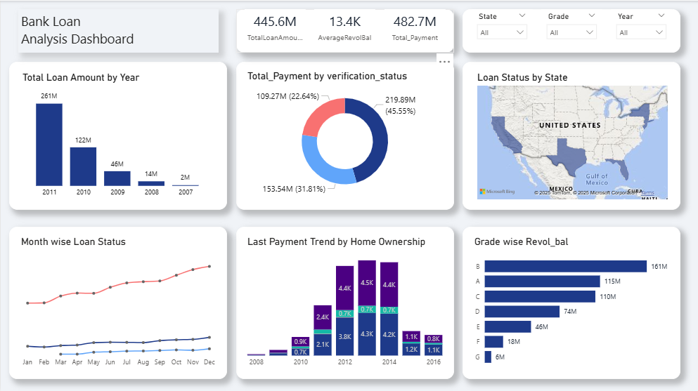

# 📊 Bank Loan Analysis Dashboard (Power BI)

---

## 📌 Project Overview
This project focuses on analyzing **Bank Loan Customer Finance Data** using **Power BI**.  
The interactive dashboard provides insights into **loan performance, customer verification, payment behavior, and risk segmentation**.  

The main objective was to transform raw financial data into meaningful **business KPIs** that can support decision-making.

---

## 🔑 Key KPIs & Insights
1. **Year-wise Loan Amount** – Understand loan growth trends across years.  
2. **Grade & Sub-grade Revolving Balance** – Analyze credit risk segmentation by grade.  
3. **Verified vs Non-Verified Payments** – Compare repayment between verified & non-verified borrowers.  
4. **Loan Status by State & Month** – Track repayment status across geography and time.  
5. **Home Ownership vs Last Payment** – Evaluate repayment patterns by home ownership type.  

---

## 🖼 Dashboard Preview

---

## 📂 Repository Contents
- `BankLoanDashboard.pbix` → Power BI project file  
- `finance.csv`, `finance2.csv` → Raw datasets  
- `project_kpi.pdf` → KPI documentation & business problem statement  
- `screenshot.png` → Dashboard preview image  

---

## 🛠 Tools & Technologies
- **Power BI Desktop** → Data cleaning, modeling & dashboarding  
- **Power Query** → ETL (Extract, Transform, Load) operations  
- **CSV / Excel** → Raw datasets  

---

## 🚀 How to Use
1. Download the `.pbix` file from this repo.  
2. Open it in **Power BI Desktop**.  
3. Use the interactive filters to explore insights.  
4. (Optional) Refresh with new data to update metrics.  

---

## 📈 Business Value
- Identifies **loan growth trends** and potential risks.  
- Helps segment customers by **credit grade & verification**.  
- Supports decision-making for **state-level and ownership-based loan strategies**.  

---

## 📝 Author
👤 **Sai Charan Gudem**  
🔗 www.linkedin.com/in/saicharangudem · 📧 saicharangudem7@gmail.com

---

⭐ *If you like this project, don’t forget to star the repo!*  

